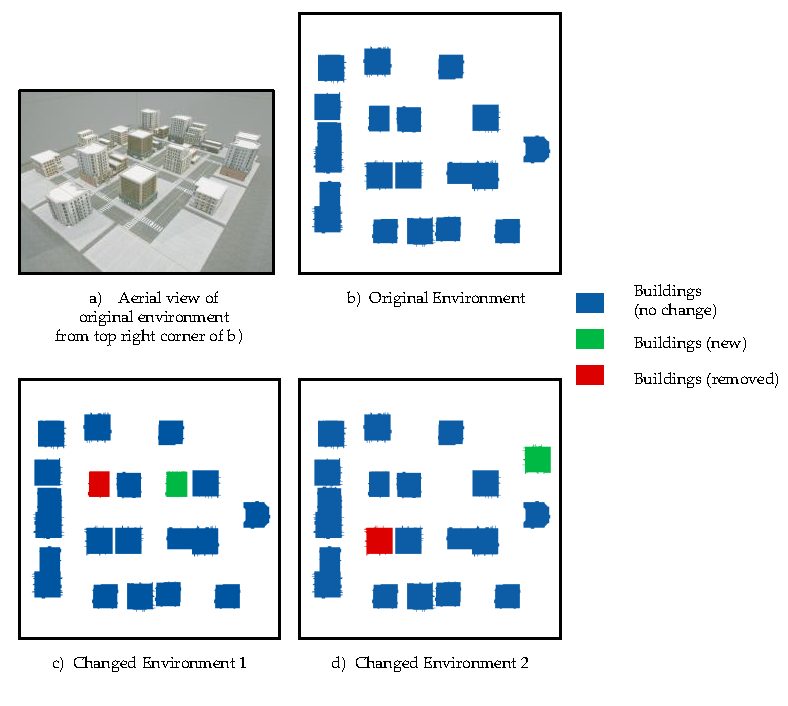
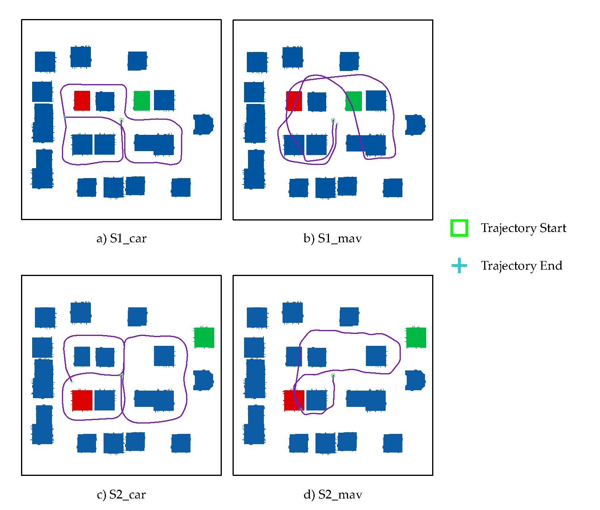
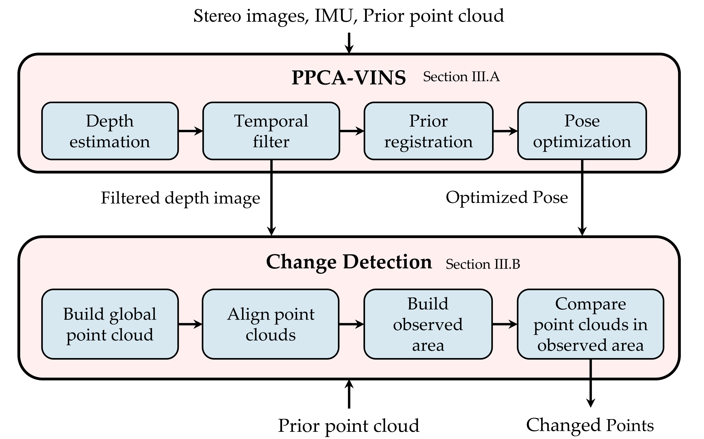

# Point Cloud Change Detection With Stereo V-SLAM: Dataset, Metrics and Baseline
### This is the project website of our paper: ***Point Cloud Change Detection With Stereo V-SLAM:Dataset, Metrics and Baseline***: [arxiv](https://arxiv.org/abs/2207.00246)

## Latest version of dataset is released. ##

### Our dataset can be downloaded at: [dataset]([https://cloud.tsinghua.edu.cn/d/ae795cd533aa4d7a8256/](https://1drv.ms/f/s!AvG2wFfXyBQMioEZfx6VZB-AaDn0OQ?e=Ww4fBS))

We build three environments in Unreal Engine 4 to collect data: original environment, changed environment 1 and 2, difference between environments are shown in following image:



Changed environments are modified basing on original environment. In each changed environment, one building is added and one building is removed, comparing to original environment.

We collect some ground truth point clouds for whole environments, and also prior new points and prior removed points.

Details are in our paper.
## rosbag

Directory bag includes rosbag used by our paper.

- S1 and S2 means for Changed scene 1 and Changed scene 2.
- dark has same scene as S1, but with dark illumination.
- mirror has same scene as S1, but with some mirrors.

Trajectories of bags are shown in following image:

  


Bags include groundtruth 6D pose, 30Hz stereo 800x450 color images, 200Hz IMU. All of these data are noiseless.

## point cloud

In each environment's directory, there are two point clouds: new.pcd and removed.pcd. These are groundtruth point clouds for new point clouds and removed point clouds in these environments. Point clouds are downsampled to 0.4m.

---

# Point cloud change detection baseline and evaluation

## Our framework


## 1.Prerequisites

You can use any Linux distros as you like, most of the prerequisites are same with VINS-Fusion.

### 1.1 **Linux** and **ROS**

Ubuntu 20.04 recommended, cause this project switch the OpenCV major version from 3 to 4, and
ROS Noetic is the first ROS 1 distro integrated with OpenCV 4.

### 1.2 C++ Compiler

This project is written with C++ 17 standard. So you need a C++ compiler which supports C++ 17. Reference to [C++ Compiler Support](https://en.cppreference.com/w/cpp/compiler_support) to get a proper compiler. (e.g. gcc 11 or clang 13)

### 1.3 Ceres Solver

If you use Ubuntu 20.04, simply do:`sudo apt install libceres* -y`.
Manually installation please follow [Ceres Installation](http://ceres-solver.org/installation.html).

### 1.4 PointCloud Library(PCL)

PCL 1.10 will be a good choice. If you are using Ubuntu 20.04, `sudo apt install libpcl-dev -y` will do that. Else follow [PCL](https://github.com/PointCloudLibrary/pcl). Version lower than 1.10 may works.

**MAKE SURE YOU INSTALL RIGHT VERSION BEFORE NEXT STEP.**

Cause FAST-GICP will run into bug if you use a higher version of pcl.

## 2.Build
```bash
mkdir -p ~/catkin_ws/src
git clone https://github.com/lnexenl/PPCA-VINS.git ~/catkin_ws/src --recursive
catkin build --workspace=~/catkin_ws/
```


## 3.Run
### 3.1 PPCA-VINS
To visualize:
```bash
roslaunch vins vins_rviz.launch
```
Using script PPCA-VINS/tools/multi_trials.sh is recommended. The script can automatically launch nodes and play bags, and will restart all nodes when node fails.

The usage of script:
```bash
source ~/catkin_ws/devel/setup.sh
./multi_trials.sh [config_file] [bag_file] [trials_this_run] [start_trial_num] [result_dir]
```
Note that **param** `output_path` and `pointcloud` in config_file should be modified to your directory before running.
`output_path` should be same as [result_dir]
`pointcloud` should be prior point cloud file. we use dataset/pcd/origin/4x.pcd file in our dataset as prior point cloud file.

[config_file] is some file in PPCA-VINS/config directory.

[bag_file] is the name of rosbag to be played.

[start_trial_num] is the number of  should be an integer. For example, if 5 experiments have been conducted, then start_trial_num should be 6 at next run of this script.

[trials_this_run] is the number of experiments that will be conducted at current run, should be an integer.

[result_dir] should be same with the `output_path` parameter in [config_file].

Before running the script, you should ensure that [result_dir] exists.

After running the script, there should be directories like [result_dir]/1, [result_dir]/2, [result_dir]/3, ..., each directory stands for results of one run.

### 3.2 PCCD_evaluation
```bash
rosrun PCCD_evaluation build_global_pc_ot [result_dir] [prior_pointcloud_file] [trial_num] [trajectory_type] [free_cast_dist]
rosrun PCCD_evaluation build_confusion_mat [result_dir] [trial_num] [trajectory_type] [free_cast_dist] [pc_min_dist]
```
[result_dir] is same as that in previous section.

[prior_pointcloud_file] is the prior point cloud to be compared.

[trial_num] specifies which trial to be evaluated.

[trajectory_type] can be prior or vio. Set to prior will use trajectory from our PPCA-VINS, set to vio will use trajectory from VINS-Fusion.

[free_cast_dist] is the distance to cast in no depth area, which is $th_f$ in our paper. ***Explained in paper***

[pc_min_dist] is the parameter $th_{ch}$ in our paper. ***Explained in paper***

For example, to evaluate result in [result_dir]/2, with trajectory from PPCA-VINS, free cast distance of 20 meters, and $th_{ch}=2.4m$.


```bash
rosrun PCCD_evaluation build_global_pc_ot [result_dir] [prior_pointcloud_file] 2 prior 20
rosrun PCCD_evaluation build_confusion_mat [result_dir] 2 prior 20 2.4
```
Results will be printed in console after all commands are executed.

